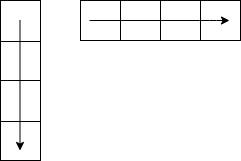

# Problem

m x n のグリッド上にロボットがあります。ロボットは、最初は左上隅に配置されています(すなわち、grid [0] [0])。ロボットは右下隅に移動しようとします(すなわち、grid [m -1] [n -1])。ロボットは、いつでも下または右にしか移動できません。2 つの整数 m と n を指定した場合、右下隅に到達するためにロボットが取ることができる一意のパスの数を返します。テストケースは、答えが 2\*10^9 以下になるように生成されます。

# 解説

※再起でもできるが、計算量は O(2^(m+n))。動的計画法は O(m\*n)で済むがその分メモリは喰う

- m=0,n=x or m=x,n=0 の時は、1 path

- m=1,n=1 の時は、2 path

grid[1][1] = grid[1][0] + grid[0][1] = 2

- m=1,n=2 の時は、3 path (m=2,n=1 も同様)

grid[1][2] = grid[0][2] + grid[1][1] = 1 + 2 = 3

- m=2,n=2 の時は、6 path

grid[2][2] = grid[1][2] + grid[2][1] = 3 + 3 = 6

grid[i][j] = grid[i-1][j] + grid[i][j-1] の漸化式が成り立つので

動的計画法で捌ける

4 × 4 なら

|     |     |     |     |
| --- | --- | --- | --- |
| 1   | 1   | 1   | 1   |
| 1   | 2   | 3   | 4   |
| 1   | 3   | 6   | 10  |
| 1   | 4   | 10  | 20  |
